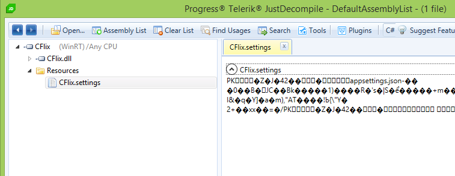

# Faille 1 & 2 : XSS
Dans le fichier `Startup.cs`, on a désactivé la sécurisation des cookies :

```csharp
options.Cookies.ApplicationCookie.CookieHttpOnly = false;
```

et dans l'affichage, utilisation du `Html.Raw` :

```asp
<div class="text">@Html.Raw(review.Content)</div>
```


# Faille 3 : SQLi
Dans le fichier `Services/Repositories/MediaRepository.cs`, mauvaise utilisation des requêtes SQL :

```csharp
return await _context.Medias.FromSql($"SELECT Id, ImageUri, Title, Type, YouTubeId, ReleaseDate FROM Medias WHERE Title LIKE '%{query}%'")
```

Ici la requête semble valide cependant la string interpolation de C# 7 agit comme une simple concaténation de la variable query à la requête. Celle-ci n'est pas "préparée" correctement par le framework, il vaut donc mieux préférer la syntaxe suivante :

```csharp
return await _context.Medias.FromSql("SELECT Id, ImageUri, Title, Type, YouTubeId, ReleaseDate FROM Medias WHERE Title LIKE '%{@query}%'", new SqlParameter("@query", query))
// ou
return await _context.Medias.FromSql("SELECT Id, ImageUri, Title, Type, YouTubeId, ReleaseDate FROM Medias WHERE Title LIKE '%{0}%'", query)
```


# Faille #4 : Misconfiguration
La première erreur qui a été faite sur cette épreuve est d'avoir fait une mise en prod en laissant la variable d'environnement `ASPNETCORE_ENVIRONMENT=Development` dans le fichier `docker-compose.override.yml` (non visible dans cette version du code)
Cela a ainsi permi à Vilain Petit Canard d'obtenir des informations importantes sur l'environnement (et donc allez chercher les fichiers sur le NAS aussi facilement)

La deuxième erreur aura été de croire que stocker les chaines de connexions dans les ressources d'une application était suffisant pour les sécuriser.



```csharp
public Startup(IHostingEnvironment env)
{
    var builder = new ConfigurationBuilder()
        .SetBasePath(env.ContentRootPath)
        .AddJsonFile("appsettings.json", optional: false, reloadOnChange: true)
        .AddJsonFile($"appsettings.{env.EnvironmentName}.json", optional: true)
        .AddFromZipRessource("settings", "appsettings.json") // <- c'était la ligne intéressante permettant de déterminer le format du fichier de configuration
        .AddEnvironmentVariables();
    Configuration = builder.Build();
}
```
Dans ce-cas là, il vaut mieux utiliser d'autre moyen pour stocker les chaines de connection comme les variables d'environnements qui elle ne seront pas présente physiquement sur le disque.


# Faille #5 : Mass Assignment
Dans ce cas-là le problème ne saute pas directement au yeux. Cependant un problème est à noté. Nous utilisons l'objet `ProfileViewModel` qui initialement n'étais pas prévu pour la requête Edit mais pour la méthode Index pour permettre d'afficher les informations sur la page `/User/Me`. Du coup, cet objet accepte le paramètre `AccountType` même si on ne l'a pas spécifié dans la view du formulaire d'édition.

```csharp
public async Task<IActionResult> Edit(ProfileViewModel profile)
{
    if (!ModelState.IsValid)
    {
        return View();
    }

    var user = await _userManager.GetUserAsync(User);
    user.UpdateWithProfileViewModel(profile);
    await _userManager.UpdateAsync(user);

    return RedirectToAction(nameof(Index), new { profileName = "me" });
}

public static void UpdateWithProfileViewModel(this CFlixUser user, ProfileViewModel model)
{
    if (model.AccountType != AccountType.User)
    {
        user.AccountType = model.AccountType;
    }

    user.AvatarType = model.AvatarType;
    user.DisplayName = model.DisplayName;
}
```

Il vaut mieux refaire un deuxième model pour s'assurer des éléments que l'on récupére auprès de l'utilisateur.


# Faille #6 : LFI - Directory Transversal 
>  **Never trust user input !**

Dans ce cas-là, une directory transversal a été introduite, juste en réutilisant les données reçu en paramètres sans les vérifier au préalable.

```csharp
public IActionResult Index(string mediaId, string image)
{
    if (string.IsNullOrWhiteSpace(mediaId) || string.IsNullOrWhiteSpace(image))
    {
        return NotFound();
    }

    var path = Path.Combine(Directory.GetCurrentDirectory(), "wwwroot", "images", mediaId, image);
    if (!System.IO.File.Exists(path))
    {
        return NotFound();
    }

    var bytes = System.IO.File.ReadAllBytes(path);

    return File(bytes, "application/octet-stream");
}
```

Si vous avez besoin de faire ce genre de manipulation, le framework ASP .Net Core vous propose une manière bien plus sécurisé de le faire :
Dans le fichier `Startup.cs`
```csharp
        public void ConfigureServices(IServiceCollection services)
        {
            // ...
            services.AddSingleton(_hostingEnvironment.WebRootFileProvider);
        }
```
Et dans le controller :
```csharp
public class ViewerController : Controller
{
    private readonly IFileProvider _fileProvider;

    public ViewerController(IFileProvider fileProvider)
    {
        _fileProvider = fileProvider;
    }

    public IActionResult Index(string mediaId, string image)
    {
        var fileInfo = _fileProvider.GetFileInfo(Path.Combine("images", image));
        if (!fileInfo.Exists)
        {
            return NotFound();
        }

        return PhysicalFile(fileInfo.PhysicalPath, "application/octet-stream");
    }
}
```
La classe [PhysicalFileProvider](http://https://docs.microsoft.com/en-us/aspnet/core/fundamentals/file-providers) permet donc d'explorer le système de fichier local de manière sécurisé. Il permet notamment de scoper l'arborescence explorable à un dossier spécifié et tout ses descendants.


# Faille #7 #8
Ces failles ne seront pas débattus ici, elle n'avait pas de rapport direct avec la programmation


# Faille #9 Component with know vulnerability : CVE-2017-5941
La faille exploité ici se situe dans le code en NodeJS. nous utilisons la library `node-serialize` qui possède une vulnérabilité permet d'éxécuter du code JS à l'aide des IIFE (Immediately Invoked Function Expression). Voir [la CVE-2017-5941](https://cve.mitre.org/cgi-bin/cvename.cgi?name=CVE-2017-5941) pour plus d'information.

```javascript
var serialize = require('node-serialize');
app.post('/cookie', function (req, res) {
    try {
        var aspCookie = serialize.unserialize(req.body);
        res.send(aspCookie);
    } catch (error) {
        res.status(500).send(error.message);
    }
});
```
Il faut donc éviter d'utiliser cette library et de manière général faire attention aux données reçu par l'utilisateur


# Faille #10
Cette fois-ci le problème se situe dans la lib `vm`. Celle-ci bien que faisant partie de node posséde un problème connu qui permet de s'echapper du context que l'on créé et permet ainsi de se retrouver directement dans le contexte principal de l'application.

```javascript
var vm = require("vm");

var script = new vm.Script(arg.arg);
var context = new vm.createContext({});
var t = script.runInNewContext(context);
```
Il vaut mieux préférer la lib `vm2` qui elle est plus sécurisé par défaut.


# Faille #11 : Binary Exploit
Nous avons cette fois-ci à notre disposition, un code écrit en C.
Celui-ci a un problème nous ne vérifions pas la longueur des données saisis par l'utilisateur. Ce qui fait qu'il peut très facilement faire un buffer-overflow.

```C
int main(int argc, char **argv)
{
    printf(":O tu es dans le Monde à l’envers, essayes d'en sortir !\n");

    char buffer[320];
    int size, i;

    scanf("%s", buffer); // <- ici nous avons un problème, il faut vérifier ce qui est saisi par l'utilisateur
    size = strlen(buffer);

    printf("Tu viens de saisir : %s\n", buffer);

    return 0;
}
```


# Faille #12 : XSS again :)
